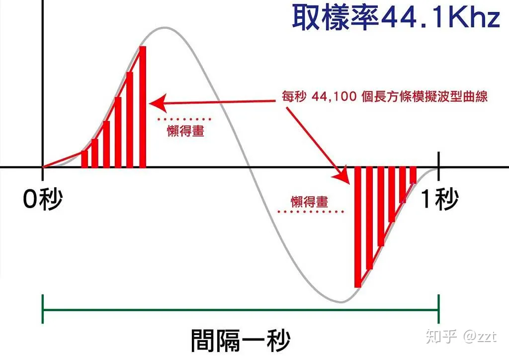
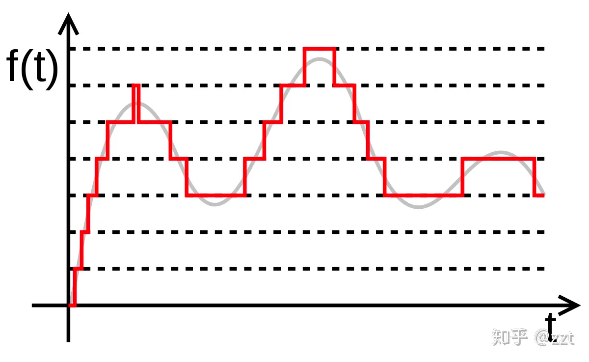

# ffmpeg推送音频流
流程：帧录制起的音频参数设置-> 音频采样对象的初始化 ->

# java捕获音频数据
DataLine和 and OutputInputStream/InputStream?  
A DataLine is an interface related to handling sampled sound (a.k.a PCM data) in Java. I don't really know a lot of that.  

An OutputStream is an interface that represents anything that can get bytes written to it. A simple sample of an OutputStream is a FileOutputStream: all bytes written to that stream will be written to the file it was opened for.  

An InputStream is the other end: it's an interface that represents anything from which bytes can be read. A simple sample of an InputStream is a FileInputStream: it can be used to read the data from a file.  

So if you were to read audio data from the hard disk, you'd eventually use a FileInputStream to read the data. If you manipulate it and later want to write the resulting data back to the hard disk, you'd use a FileOutputStream to do the actual writing.

# sdp
## SDP消息体最重要的是描述媒体信息
1 媒体类型（video、audio、bfcp、h225摄像机控制协议，etc）  
2 传输协议（RTP/UDP/IP, H.320, etc）  
3 媒体格式（G711，G721，AAC-LD，H.264 video, MPEG video, etc）
4 多播或单播地址和端口
5 本端的带宽信息  
6 本端的加密信息
#### c行地址  
c=IN IP4 192.168.8.76  
解释：c=<网络类型> <地址类型> <地址>，定义连接地址，其中地址类型可以为域名形式  
#### b行带宽  
b=AS:1920  
解释：b=<类型>:<带宽>，定义本端可以接收的带宽，其中带宽可以分为CT和AS两类，CT是设置整个会议的带宽，AS是设置单个会话的带宽，它们的单位都是kbit/s。TIAS和AS的意义是一样的，只是单位是bit/s。  
#### 音频m行  
m=audio 10004 RTP/AVP 0 1 3     //m=<媒体类型> <媒体端口> <传输协议> <编码pt值的集合>  
a=rtpmap:0 PCMU/8000                //a=rtpmap:<pt值> <音频协议> <采样率>  
a=rtpmap:1 1016/8000a=rtpmap:3 GSM/8000  
a=sendonly                                    //a=本端媒体流的方向，取值包括sendonly/recvonly/sendrecv/inactive  
a=ptime:20                                    //a=打包时长  
a=crypto:1 AES_CM_128_HMAC_SHA1_80 inline:NHomSmlnXy4qRCwhVi9ANVcwZ3Q3cXVaLykzJ1Rf|2^31|1:1  
解释：音频能力一般协商协议、采样率。媒体能力是允许不对称的，这里的能力和pt值指的是本端允许接收的，而加密属性表示的是本端发送时使用的秘钥和加密算法  
参考：https://forum.huawei.com/enterprise/zh/thread/580935807961808896

# 音频
## 收集信号到生成音频文件的过程
模拟信号->采样->离散信号->量化->数字信号->编码->音频文件

### 采样：

模拟信号转为离散信号，采样率44.1Khz就是将一段波每 1s 分为 44100 个矩形

### 量化
量化就是在沿水平方向再将信号图按照一定数字范围切断，保证每段样本能用数字描述

量化标准是什么呢？采用16bit(short)，也就是2的16次方，总共65536，然后为了由于振膜是可以发生正向和负向位移，所以用[-32767,32768]进行量化

### 编码
编码，就是按照一定的格式记录采样和量化后的数据，比如顺序存储或压缩存储。
音频的裸数据格式就是脉冲编码调制数据，简称 PCM （Pulse Code Modulation)。描述一段 PCM 通常需要以下三个概念： SampleFormat、SampleRate Channel
对于声音格式来说，还可以用BitRate（也叫码率）描述它的大小，即 1s 内的比特数目，用于衡量音频数据单位时间内的容量大小，那么BitRate如何计算？
BitRate=SampleFormat * SampleRate * Channel，单位为千比特每秒kbps(kb per second)。
比如对于CD音质， 16 * 44100 * 2=1378.125kbps， 那么，一分钟里，CD音质数据需要占多大存储空间呢？ 1378.125*60/8/1024=10.09MB

### 压缩
几种音频压缩编码：wav、mp3、aac、ogg。
压缩比：压缩后大小/原大小，通常小于 1，越小表示压缩的越狠

# ffmpeg是什么
ffmpeg是一种音视频处理软件，c语音写的，通过该软件可以实现对音视频进行编解码、推拉流等常见操作,可以通过ffmpeg.exe 、ffmpeg API使用ffmpeg。由于ffmpeg
API是c写的，java不能直接调用，java可以通过

# linux-debian 安装 ffmpeg
1、编辑/etc/apt/sources.list加入
deb http://www.deb-multimedia.org jessie main
2、安装ffmpeg
sudo apt-get update
sudo apt-get install deb-multimedia-keyring
sudo apt-get install ffmpeg

# MacOS 安装 ffmpeg
//下载安装ffmpeg
$ brew install ffmpeg
//删除ffmpeg
$ brew remove ffmpeg

# ffmpeg常用命令和参数
推流： ffmpeg -re -i input.mp4 -framerate 15 -s 1280x720 -c:v libx264 -b:v 1000k -strict -2 -f flv rtmp://localhost:1935/live/room
分辨率：1280x720
libx264：264编码

拉流：ffmpeg -i rtmp://58.200.131.2:1935/livetv/hunantv -c copy dump.flv

