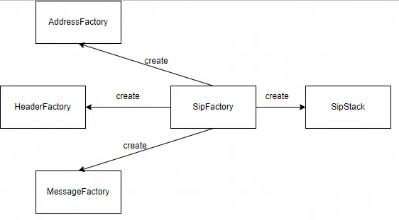
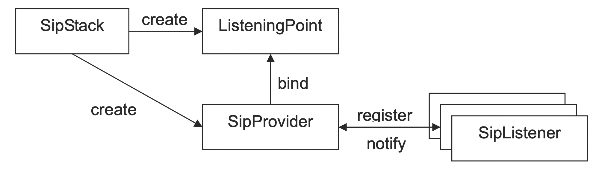
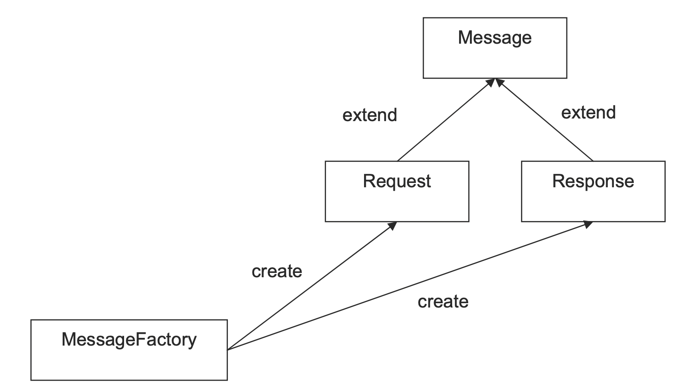
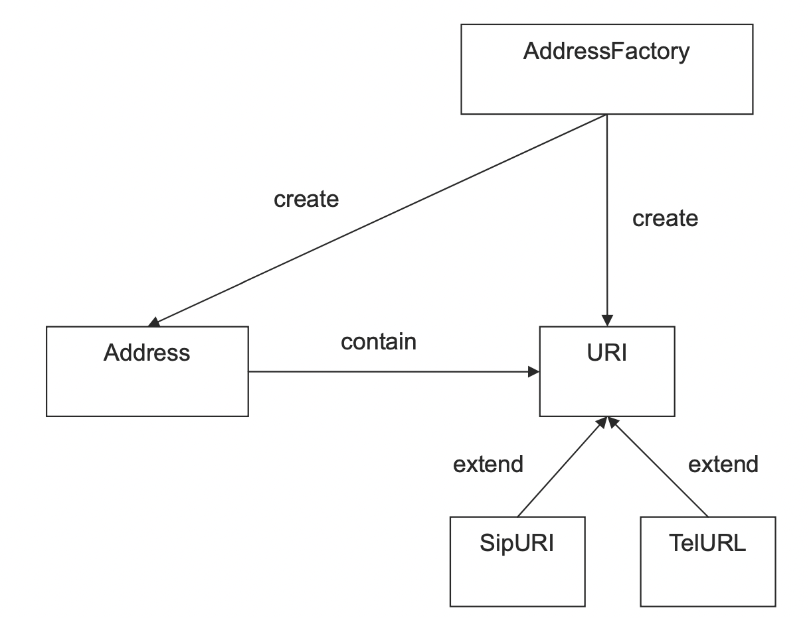
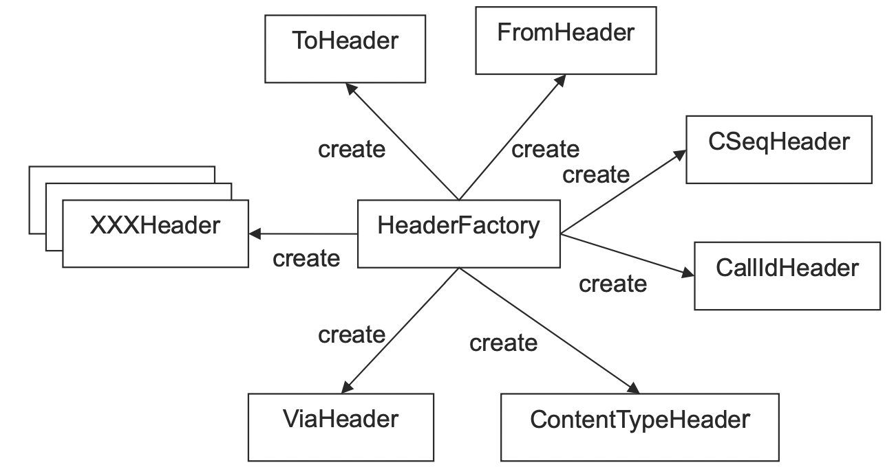
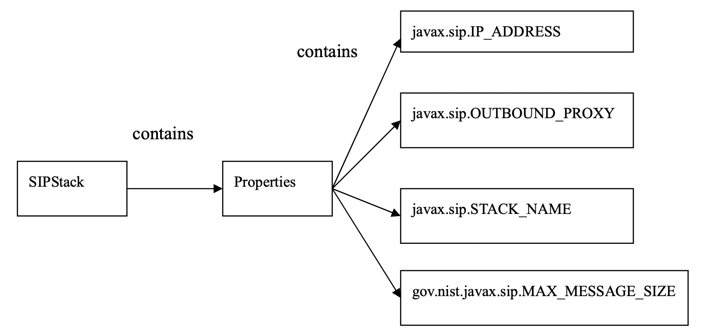
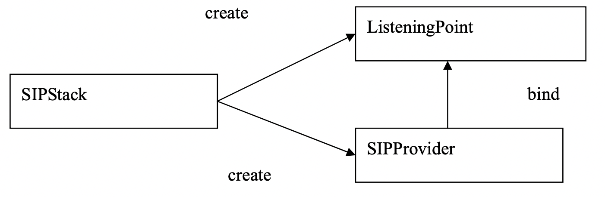
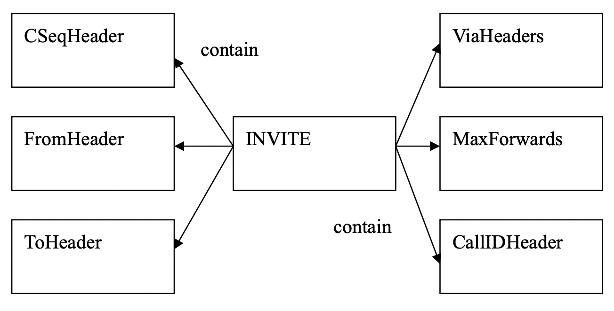
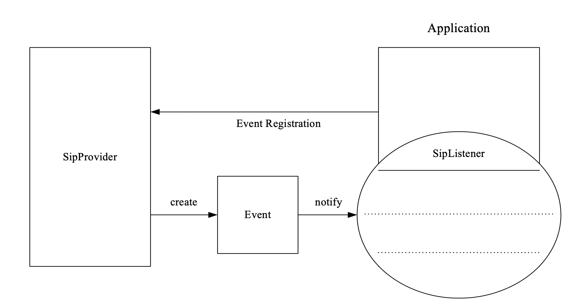

# 二、JAIN SIP
## 2.1 概述
JAIN SIP是Java API for SIP的缩写，是Java平台上的一个SIP协议栈，用于开发基于SIP的应用程序，如VoIP电话、会议、即时消息等。JAIN SIP提供了一组API，使开发人员可以轻松地创建、发送和接收SIP消息。它基于标准的SIP协议，支持RFC 3261规范，并提供了一些扩展功能，如负载均衡、可靠传输和安全传输等。JAIN SIP可以与其他Java平台技术（如Java Servlet、JavaBeans和Java Media Framework）无缝集成，使得开发SIP应用程序变得更加容易和灵活。

## 2.2 JAIN SIP  Packages
JAIN SIP包含了四个主要的packages，它们分别是：

javax.sip：这个package包含了JAIN SIP的核心API，提供了创建、发送和接收SIP消息的基本功能，同时也提供了一些与SIP相关的辅助类和接口，如地址解析、会话管理等。

javax.address：这个package含了代表 SIP 协议中 Addressing 部分的内容，其中定义了 URI 接口，而通常被称为 URI 接口又可以分为 SipURI 和 TelURI。

javax.sip.header：该package包含了SIP头相关的API，SIP头用于在SIP消息中传递额外的信息，如发件人、收件人、会话参数等。

javax.sip.message：该package包含了SIP消息相关的API，提供了SIP消息的创建、解析和操作等功能，同时也提供了一些与SIP消息相关的辅助类和接口。

## 2.3 JAIN SIP 对象介绍和对象间关系
### 2.3.1 以 SipFactory 为中心生成其他接口和类
在JAIN SIP的主要架构中，大量使用了面向对象的工厂模式，使得应用程序的开发与JAIN的实现类架构无关，
提高了应用程序的可移植性。在JAIN的架构中， 应用程序以SipFactory为中心生成其他相关类或接口，包
括AddressFactory、HeaderFactory、MessageFactory和重要的SipStack，如图所示。 我们可以通
过使用getInstance()方法获取唯一的SipFactory。  


### 2.3.2 JAIN SIP 底层机制
#### 2.3.2.1 SipStack 接口
当使用 SipFactory 生成其他接口或类时，其中最重要的是 SipStack 接口。我们可以将 SipStack 
视为与外界通信的网络接口卡，该接口可用于接收网 络上传来的消息或对象，并将其传递给内部应用程序
进行处理，或将内部的消息或对象发送到网络上。每个网络接口卡都有一组自己的IP地址，因此在同一个应
用程序中，一个IP地址只能对应一个SipStack。  


#### 2.3.2.2 SipProvider接口
在获得SipStack接口之后，接下来我们需要为应用程序建立SipProvider接口。如图三所示，SipProvider是JAIN SIP事件
模型的中心。通过它，我们可以处理从SipStack发送过来的事件，并调用相应的函数进行处理。

每个SipStack可能会有一个以上的SipProvider，每产生一个SipProvider则需要给定一个port端口号，因此不同port端口号
的SipProvider则负责处理接收属于自己端口号传来的消息。我们可以通过SipStack的createSipProvider(ListeningPoint)
方法来建立新的SipProvider。在JAIN SIP中，端口号是用ListeningPoint接口代表的。

#### 2.3.2.3 SipListener接口
当拥有了SipStack和SipProvider之后，最后一个JAIN SIP中的重要接口为SipListener。SipListener必须向SipProvider
注册，以接收从SipProvider传送过来的事件。每个SipListener可以向多个SipProvider注册。我们可以将SipListener接口
视为开发者所实现的应用程序。

当实现SipListener接口时，必须包含processRequest()、processResponse()以及processTimeout()三种方法，分别
处理 接收到的request、response和timeout事件。

#### 2.3.2.4 Event对象
当SipProvider接收到来自SipStack的Message时（Request或Response），SipProvider会将该Request
或Response加入Event对象内，并透过对应的Event Handler通知SipListener。例如，当接收到Request时，
SipProvider会呼叫已登记SipListener的processRequest()方法，此时应用程序便可作适当的处理。


### 2.3.3 JAIN SIP如何进行状态管理

#### 2.3.3.1 Transaction接口

#### ClientTransaction

发送请求时 使用 ClientTransaction，使用SipProvider的getNewClientTransaction()方法创建新的 ClientTransaction。

#### ServerTransaction
收到请求时使用 ServerTransaction 回复，使用SipProvider的getNewServerTransaction()方法创建新的ServerTransaction

#### 2.3.3.2 Dialog接口
用dialog创建请求的好处是不需要再次赋值基本信息
在会话进行中再次发送request必须使用dialog
比如在通话中发送bye请求或者发送ack请求，必须先获得dialog，通过dialog才能发送bye或者ack
比如收到200时发送ack：

``` java
//先获取dialog，获取dialog有两种方式，通过Transaction获取或者直接通过ResponseEvent获取
//方法1:现获得Transaction，通过Transaction 获得dialog
Transaction tid = responseReceivedEvent.getClientTransaction();
Dialog dialog = tid.getDialog();
//方法2:直接通过ResponseEvent获取
responseEvent.getDialog()

//通过dialog发送ack
Request ackRequest = dialog.createRequest(Request.ACK);
dialog.sendAck(ackRequest);
```
比如收到bye请求回复：
``` java
// 创建 Bye 请求
Request byeRequest = session.createRequest("BYE");

// 发送 Bye 请求
ClientTransaction transaction = sipProvider.getNewClientTransaction(byeRequest);
transaction.send();
```


### 2.3.3 使用MessageFactory生成的Message对象

当我们介绍SipFactory接口时，提到SipFactory可以帮助我们创建MessageFactory，使用MessageFactory
可以创建SIP协议中的Request和Response消息对象。在JAIN SIP中，Message对象可视为Request和Response
的泛型，目的是将Request和Response共用的方法集合并在同一接口中。Request和Response分别对应SIP协议
中的各种Request和Response类型，使用MessageFactory创建时，应用程序需要指定所需的类型信息（例如INVITE、
ACK或180、200等）。

### 2.3.4 使用 AddressFactory 生成的 Address 对象

AddressFactory是由SipFactory生成的，生成后应用程序利用此对象生成Sip协议的各种URI相关对象，其中URI
为SipURI和TelURL的泛型（Generic Type），目的是将SipURI和TelURL两者共用的方法集中在同一界面上，并
预留日后扩展之用。另外值得注意的是，Address对象除了包含URI对象之外，还包含用来显示用户名的display name，
display name通常会显示在用户界面上，以方便用户判断来电者为何。

### 2.3.5 使用HeaderFactory 生成的 Header 对象

HeaderFactory是由SipFactory生成的，生成后应用程序利用此对象生成Sip Protocol的所有Header相关对象，例如ToHeader、
FromHeader、CseqHeader等。JAIN SIP规格将每一个不同类型的头定义为对象，并且所有在RFC3261中定义的Header在API中都
有相应的类别。

## 2.4 Transaction

## 2.5 Dialog

# 三、实际代码
## 3.1 pom
具体版本可以参考 https://mvnrepository.com/artifact/javax.sip
``` java
        <dependency>
            <groupId>javax.sip</groupId>
            <artifactId>jain-sip-api</artifactId>
            <version>1.2.1.4</version>
            <scope>provided</scope>
        </dependency>
        <!-- https://mvnrepository.com/artifact/javax.sip/jain-sip-ri -->
        <dependency>
            <groupId>javax.sip</groupId>
            <artifactId>jain-sip-ri</artifactId>
            <version>1.3.0-91</version>
            <scope>provided</scope>
        </dependency>
        <dependency>
            <groupId>log4j</groupId>
            <artifactId>log4j</artifactId>
            <version>1.2.8</version>
        </dependency>
```
因为jainsip 用到了log4j，所以pom里也要加入，不然会报错
``` java
Caused by: java.lang.reflect.InvocationTargetException
at sun.reflect.NativeConstructorAccessorImpl.newInstance0(Native Method)
at sun.reflect.NativeConstructorAccessorImpl.newInstance(NativeConstructorAccessorImpl.java:62)
at sun.reflect.DelegatingConstructorAccessorImpl.newInstance(DelegatingConstructorAccessorImpl.java:45)
at java.lang.reflect.Constructor.newInstance(Constructor.java:423)
at javax.sip.SipFactory.createStack(SipFactory.java:314)
... 26 more
Caused by: java.lang.NoClassDefFoundError: org/apache/log4j/Priority
at java.lang.Class.forName0(Native Method)
at java.lang.Class.forName(Class.java:264)
at gov.nist.javax.sip.SipStackImpl.<init>(SipStackImpl.java:799)
... 31 more
Caused by: java.lang.ClassNotFoundException: org.apache.log4j.Priority
at java.net.URLClassLoader.findClass(URLClassLoader.java:387)
at java.lang.ClassLoader.loadClass(ClassLoader.java:418)
at sun.misc.Launcher$AppClassLoader.loadClass(Launcher.java:355)
at java.lang.ClassLoader.loadClass(ClassLoader.java:351)
... 34 more
```

## 3.2import 包
``` java
import javax.sip.*;
import javax.sip.address.*;
import javax.sip.header.*;
import javax.sip.message.*;
```
## 3.3 initialization


### 3.3.1 SipFactory
``` java
sipFactory = javax.sip.SipFactory.getInstance();
sipFactory.setPathName("gov.nist");
```
一个应用程序只要创建一个sipFactory就行了

### 3.3.2 SipStack
SipStack 被视为 与外界通信的网络接口卡，该接口可用于接收网络上传来的消息或对象，并将其传递给内部
应用程序进行处理， 或将内部的消息或对象发送到网络上。 

每个网络接口卡都有一组自己的IP地址，因此在 同一个应用程序中，一个IP地址只能对应一个SipStack,但
可以有多个listeningPort

在生成SipStack对象时，必须先指定该对象的属性（Property），属性的内容包括IP地址、堆栈名称、
出站代理等参数，并通过SipFactory的createSipStack(Properties)方法进行建立。


因此，在建立SipStack之前，我们必须建立Properties对象以存储这些属性

首先创建新的properties对象。
```
Properties properties = new Properties();
properties.setProperty("javax.sip.IP_ADDRESS", "localhost");
properties.setProperty("javax.sip.OUTBOUND_PROXY", "fs地址或者kamilio地址:端口/udp");
properties.setProperty("javax.sip.STACK_NAME", "JainSipPhone");
// 设置最大的信息长度，这里设置 2^20，超过就认为是恶意攻击
properties.setProperty("gov.nist.javax.sip.MAX_MESSAGE_SIZE", "1048576");
```
有了SipFactory对象之后，我们就可以使用它的createSipStack()方法创建新的SipStack。在创建时，
必须提供预先设置好的Property对象。

```
try {
    SipStack sipStack = sipFactory.createSipStack(properties);
} catch (PeerUnavailableException e) {
    System.err.println(e.getMessage());
}
```

### 3.3.3 ListeningPoint

如图所示，我们可以通过SIPStack对象创建新的ListeningPoint，ListeningPoint代表网络接口的端口号，因此在创建时必须指定端口号和使用的传输协议。
``` java
//指定ip
ListeningPoint listeningPointUdp = sipStack.createListeningPoint(localPort, "udp");
//不指定ip，一般不需要指定ip
ListeningPoint listeningPointUdp = sipStack.createListeningPoint(String ipAddress, int port,String transport)
```

### 3.3.4 SipProvider
通过SipStack的createSipProvider()方法，我们可以创建属于此SipStack的SipProvider对象。在创建时，必须提供之前创建的ListeningPoint对象作为参数。以下是示例代码：
``` java
SipProvider sipProvider = sipStack.createSipProvider(listeningPointUdp);
```
这样，我们就可以使用该SipProvider对象接收和处理SIPStack发送的事件。
一个sipStack可以创建多个sipProvider，这样就多可以创建多个SipListener实例了，示例代码如下
``` java
    private static void createSipProvider(Integer initialPort){

            int count = 0;

            while(count<step){
                try {
                    SipStack sipStack = sipFactory.createSipStack(prop);
                    ListeningPoint listeningPointUdp = sipStack.createListeningPoint(localPort, "udp");
                    SipProvider sipProvider = sipStack.createSipProvider(listeningPointUdp);
                    if (sipProvider != null) {
                        sipProviderMap.put(localPort, sipProvider);
                        portSet.add(localPort);
                        localPort++;
                        count++;
                    }
                } catch (TransportNotSupportedException | ObjectInUseException e){
                    throw new RuntimeException(e);
                } catch (InvalidArgumentException e){
                    //如果端口号被占用
                    localPort++;
                } catch (PeerUnavailableException e) {
                    throw new RuntimeException(e);
                }
            }
    }
```
### 3.3.5 SipListener
我们在实现应用程序时需要实现SipListener接口，每个SipListener都可以向SipProvider注册，以接收从SipProvider传送过来的消息。
在JAIN API中，我们可以通过以下方式将SipListener注册到SipProvider上
``` java
public class BasicPhone implements SipListener{
    sipProvider.addSipListener(listener);
}
```
### 3.3.2 HeaderFactory
HeaderFactory headerFactory = sipFactory.createHeaderFactory();

### 3.3.3 AddressFactory
AddressFactory addressFactory = sipFactory.createAddressFactory();

### 3.3.4 MessageFactory
MessageFactory messageFactory = sipFactory.createMessageFactory();

### 封装sipProviderPool
把获得sipProvider的代码封装成sipProviderPool，程序启动时自动自动创建好很多个sipProvider提供给SipListener
使用,代码参考[SipProviderPool.md](phoneByJainSip/SipProviderPool.md)

## 3.4 INVITE场景编写

## 3.4.1 UAC Create and Send INVITE Request
在成功建立JAIN SIP的基础对象之后，我们可以开始编写程序的第一步：UAC向UAS发送INVITE消息。

在构建消息之前，我们必须先构建消息中包含的所有头部。以INVITE消息为例，成功构建一个INVITE消息需要包含六个头部对象：CSeqHeader、FromHeader、ToHeader、ViaHeaders、MaxForwards、CallIDHeader。



以下是构建和发送INVITE消息的原始代码：
``` java
// 创建FromHeader对象
SipURI fromUri = addressFactory.createSipURI("user1", "example.com");
Address fromAddress = addressFactory.createAddress(fromUri);
fromAddress.setDisplayName("User1");
FromHeader from = headerFactory.createFromHeader(fromAddress, generateRandomString());

其中generateRandomString() 是为了获取一个随机的 tag
public static String generateRandomString() {
int length = 10;
String characters = "abcdefghijklmnopqrstuvwxyz0123456789";
Random random = new Random();
StringBuilder sb = new StringBuilder(length);
for (int i = 0; i < length; i++) {
int randomIndex = random.nextInt(characters.length());
char randomChar = characters.charAt(randomIndex);
sb.append(randomChar);
}
return sb.toString();
}
//有 setDisplayName 的样例：
//From: "User1" <sip:user1@example.com>;tag=12345
//没有 setDisplayName 的样例：
//From: <sip:user1@example.com>;tag=12345


// 创建ToHeader对象
SipURI toUri = addressFactory.createSipURI("user2", "example.com");
Address toAddress = addressFactory.createAddress(toUri);
toAddress.setDisplayName("User2");
//代表 接收端的toTag 必须由接收端设定，所以先设置成 null
ToHeader to = headerFactory.createToHeader(toAddress, null);
//有 setDisplayName 的样例：
//To: "User2" <sip:user2@example.com>
//没有 setDisplayName 的样例：
//To: <sip:user2@example.com>


// 创建ViaHeader对象
ViaHeader via = headerFactory.createViaHeader("本地ip", 监听端口, "传输方式", null);
// 创建Via头域
// 由于 via 头域通常包含许多经过的地址信息，所以新增一个 ArrayList
ArrayList<ViaHeader> viaHeaders = new ArrayList<ViaHeader>();
ViaHeader viaHeader = headerFactory.createViaHeader("10.221.146.253", 5060, "udp", null);
viaHeaders.add(viaHeader);
// maxforwardsHeader 请求最大次数
MaxForwardsHeader maxForwards = headerFactory.createMaxForwardsHeader(70);

// 创建CSeq头域
CSeqHeader cSeqHeader_invite = headerFactory.createCSeqHeader(1L, Request.INVITE);
CSeqHeader cSeqHeader_register = headerFactory.createCSeqHeader(1L, Request.REGISTER);

// 创建CallIDHeader对象
// 通过 SipProvider 的 getNewCallID() 方法获取新的 CallIDHeader。使用 SipProvider 提供的方法可以获取代表此对话的唯一 Call ID，而 HeaderFactory 提供的方法则需要手动输入 Call ID 字符串，并且不能保证唯一性。
CallIdHeader callId = sipProvider.getNewCallId();

// 创建INVITE请求消息
Request inviteRequest = messageFactory.createRequest(toAddress.getURI(),
Request.INVITE, callId, cseq, from, to, via, maxForwards);
// 也可以重新创建一个 SipURI
SipURI requestURI = addressFactory.createSipURI(toUser,registrarAddress);
Request request = messageFactory.createRequest(requestURI, Request.INVITE, callId, cseq, from, to, via, maxForwards);
// 设置消息体
inviteRequest.setContent("Hello world!", contentTypeHeader);

// 发送INVITE请求消息
// 在有了INVITE请求消息后，需要创建一个新的ClientTransaction对象将消息发送到网络上。可通过SipProvider的getNewClientTransaction()方法获取新的ClientTransaction对象，该对象是根据给定的请求消息生成的。生成后，该对象将专门处理该请求消息，无法用于处理其他消息。
ClientTransaction inviteTransaction = sipProvider.getNewClientTransaction(inviteRequest);
inviteTransaction.sendRequest();
```

## 3.5 UAS Receive INVITE and Send Response
在介绍 UAS 端如何处理收到的 INVITE 消息并回传 Response 消息时，我们先介绍 SipProvider 
和 SipListener 之间的事件处理关系，如图 3.12 所示。


SipListener 是我们实现应用程序的一部分，其目的是为了接收从外界传来的事件。这些事件包括 
Request Event、Response Event 和 Timeout Event，这些事件通过 SipProvider 发送
给 SipListener 实现的方法。例如，SipProvider 通过 processRequest(RequestEvent) 
方法发送 Request 事件。当 SipListener 接收到事件后，将进行相应的处理。在这里，我们需
要编写处理这些事件的代码。

假设JainSipPhone 是我们实现的应用程序。
``` java

public void JainSipPhone::processRequest(RequestEvent requestEvent) {
//一开始我们必须先获取接收到的请求对象，在这里使用 RequestEvent 的getRequest() 方法获取接收到的请求事件。
Request request = requestEvent.getRequest();
// 接下来判断 request 的类型，在这里我们以 INVITE 信息为例
if (request.getMethod().equals(Request.INVITE)) {
//当收到 INVITE 消息之后，应用程序必须回传 response 消息给对方，首先是建立 180/Ringing 的 response 消息，response 消息是根据 request 消息而来的，所以建立时除了给定 response 的 code number (180)之外，还包括相对的 request 对象，建立时使用 MessageFactory 的 createResponse() 方法。
Response response = messageFactory.createResponse(180, request);
// 使用 Response 对象的 getHeader() 方法获取 response 的 ToHeader 对象，使用时需给定 Header (ToHeader.NAME)名称。其中 String NAME = "To";
ToHeader toHeader = (ToHeader)response.getHeader(ToHeader.NAME);
// 使用 ToHeader 的setTag() method 设定 toHeader tag为4321
toHeader.setTag("4321");

		//在获得response对象后，我们可以将其发送到网络上。首先，使用SipProvider的getNewServerTransaction()方法获取与此请求对应的服务器事务。在使用该方法时，需要提供接收到的request信息。
    ServerTransaction serverTransaction = sipProvider.getNewServerTransaction(request);
    // 最后，使用 ServerTransaction 的 sendResponse() 方法将响应发送到网络上。在使用时需要提供要发送的响应。
		serverTransaction.sendResponse(response);
    // 在发送完180/Ringing响应后，接下来要建立200/Ok响应。建立200/Ok响应的方法和180/Ringing响应大致相同。
    response = messageFactory.createResponse(200, request);
    // 获得 toHeader 对象
    toHeader = (ToHeader) response.getHeader(ToHeader.NAME);
    // 设定 response toHeader tag = 4321
    toHeader.setTag("4321");
    //我们使用之前建立的ServerTransaction对象将200/OK消息发送到网络上。
		serverTransaction.sendResponse(response);
}


}
```

## 3.6 UAC Receive Response and Send ACK
现在介绍UAC如何处理UAS所发送过来的Response消息，并发送ACK Request来完成三方握手协议。处理
Response的方法是实现processResponse()方法，在这里我们以收到200/OK response为例。以下是
processResponse()的原始代码。
``` java
public void JainSipPhone::processResponse(ResponseEvent responseReceivedEvent) {
Response response = responseReceivedEvent.getResponse();
log.info("[processResponse]:" + response);
//通过使用ResponseEvent的getClientTransaction()方法获取与该Response对象相关的ClientTransaction，该ClientTransaction可以帮助发送响应的Request对象。
Transaction tid = responseReceivedEvent.getClientTransaction();
// invite 后，fs会下发 100trying，,180Ringing，然后才是 200OK。response.getStatusCode() == 200：获取响应的状态码，判断是否为 200，即 OK 状态码，表示请求成功。
//        ((CSeqHeader)response.getHeader(CSeqHeader.NAME)).getMethod().equals(Request.INVITE)：从响应中获取 CSeq 头，判断其中的方法类型是否为 INVITE。CSeq 头中包括了 SIP 请求的序列号和方法类型，因此可以通过这个头来判断响应对应的请求是否为 INVITE 请求。
//        综合起来，这段代码的作用是判断 INVITE 请求的响应是否成功，如果响应状态码为 200 并且响应对应的请求方法为 INVITE，则认为请求成功，并将 flag 设置为 true。
boolean flag = response.getStatusCode() == 200 && ((CSeqHeader)response.getHeader(CSeqHeader.NAME)).getMethod().equals(Request.INVITE);
if (flag) {
// 使用ClientTransaction的getDialog方法获取属于此事务的Dialog
Dialog dialog = tid.getDialog();
try {
//利用Dialog的createRequest()方法建立ACK请求对象，建立时必须指定请求名称。
Request ackRequest = dialog.createRequest(Request.ACK);
//使用Dialog的sendACK()方法将ACK请求发送到网络上。
dialog.sendAck(ackRequest);
} catch (SipException e) {
throw new RuntimeException(e);
}
}
}
```

## 3.7 UAS Receive Ack
当UAS收到ACK消息之后，代表SIP会议已经成功建立，接下来则需要开启媒体比特流，进行媒体会议。

在本节中，我们将讨论UAS如何通过SipListener实现的processorRequest()方法处理ACK请求，
以下是处理ACK请求的原始代码。

``` java 
public void JainSipPhone::processRequest(RequestEvent requestEvent) {
//首先先获得 Request 对象
Request request = requestEvent.getRequest();
// 判断是否收到 ACK
if (request.getMethod().equals(Request.ACK)) {
// 接下来是 media transmission
...
}
}
```

## BYE场景编写
需要注意的，发送bye必须使用dialog发送request，因为bye时必须要知道要结束的是哪通会话
### 3.8.1 UAC Send BYE
``` java
    public Integer sendBye(String dialogID){

        //如果通话已经结束，直接返回
        if(!dialogMap.containsKey(dialogID))  return 200;

        try{
            Dialog dialog = dialogMap.get(dialogID);
            Request byeReq = dialog.createRequest(Request.BYE);
            ClientTransaction clientTran = sipProvider.getNewClientTransaction(byeReq);
            //这里必须用dialog发送，不然会报错
            dialog.sendRequest(clientTran);
        } catch (SipException e){
            e.printStackTrace();
            return 8000;
        }
        return 200;
    }
```
## 3.8.2 UAS Receive BYE and Send 200

首先需要判断一下ServerTransaction是否存在，如果存在不需要新建，不存在需要使用
sipProvider.getNewServerTransaction()新建ServerTransaction。

然后使用ServerTransaction的 sendResponse() 方法发送 200 OK 响应。最后，删除对话以结束
SIP 会话。 如果不使用ServerTransaction的 sendResponse()，而是用sipProvider.sendResponse()，会报错
提示事务已存在。

需要注意的是，在处理 BYE 请求时，应该始终发送 200 OK 响应，以遵守 SIP 协议规范。
``` java
    public void receiveBye(Request request,RequestEvent requestEvent){

        try {
            ServerTransaction serverTransaction = requestEvent.getServerTransaction();
            if (serverTransaction == null) {
                serverTransaction = sipProvider.getNewServerTransaction(requestEvent.getRequest());
            }

            Response response = messageFactory.createResponse(Response.OK, request);
            serverTransaction.sendResponse(response);
            log.info("send 200 for bye:" + response);

            Dialog dialog = requestEvent.getDialog();
            dialogMap.remove(dialog.getDialogId());
            dialog.delete();

        } catch (SipException | InvalidArgumentException | ParseException e) {
            e.printStackTrace();
        }
    }
```

## 3.8.2 UAC send BYE 收到 200
UAC send BYE后，如果收到UAS回复的200，需要把当前dialig delete
``` java
    dialog.delete();
```
