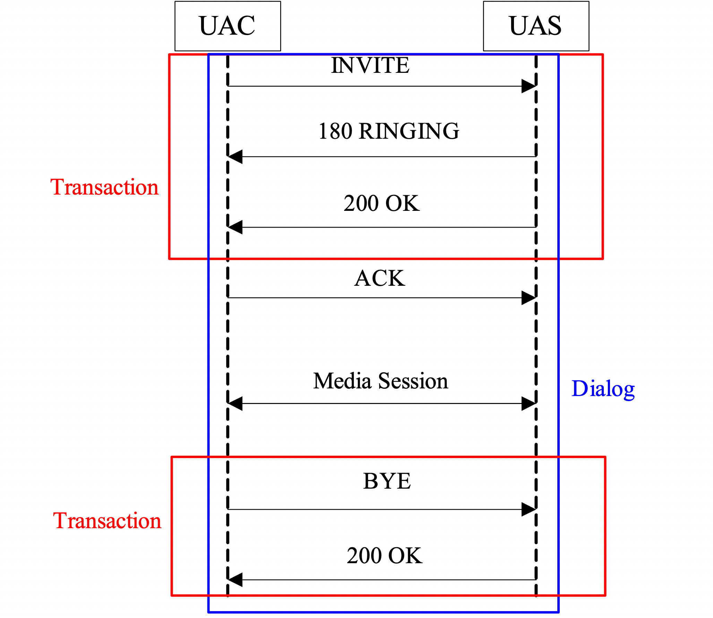

# 一、基础理论介绍
## 1.1 sip的主要功能
SIP的主要功能是允许用户或设备通过消息传递来产生互动，这些消息可以满足以下四种目的：

用户向系统注册；
邀请用户参加互动会议；
协商会议媒体内容的格式；
建立两端点或更多人之间的媒体流；
结束会议

### 1.1.1 用户向系统注册
SIP提供了注册的机制将用户和系统做连接。当SIP电话或终端设备为在线状态时，通常第一件要做的事就是发送REGISTER消息给Registration服务器，告知目前所在的联络位址和相关信息，而Registration服务器则会将用户ID和IP地址结合起来记录在Location Server的数据库里，以供日后使用。注册的机制可以使用户具可移动性的优点，用户只需随时向服务器更新自己的IP地址，便可使用相同ID，在不同地区或设备上让其他联络人找到自己，而不需固定在某一IP地址上。

注册的机制并不是必要的，SIP电话在知道双方IP地址的条件下，也可以不用透过任何服务器达成建立连线的目的。注册的机制通常都有时效的限制，而使用者则必须每隔一段时间和服务器联络，以随时更新目前的位址。

### 1.1.2 邀请用户参加互动会议

在SIP的系统里，建立会议的定义就是通过发送INVITE消息给一到多个设备建立双方连接，等建立连线后双方便可传送语音、影像或其他数据资料。在SIP里定义的位址可能是传统的电话号码、直接的IP地址或SIP URIs等，当使用者想邀请另一方加入会议，使用者只需在设备里键入对方的位址，并等待对方的回应。

在等待对方回应的过程中，SIP设备会建立INVITE消息并将它传送到网络上，透过Proxy或Redirection Server到Location Server寻找对方真实的IP地址，有了Location Server提供的资讯，系统便可以判断如何将邀请传达给对方。

### 1.1.3 协商会议媒体内容的格式

建立SIP会议的主要目的是用来传送双方的媒体内容，所以在SIP传送的讯息内容中会附加可提供的媒体格式供对方参考。和email服务相同，SIP协议只关心所传送的讯息内容，并不管所附加的内文是什么，而在SIP里最常使用到的附加内文则采用Session Description Protocol (SDP, RFC 2327)协议格式。

当接收方收到INVITE讯息的时候，接收方可以选择接受或拒绝这次的邀请。有时候接收方拒绝邀请的原因是因为它没有足够的能力接受对方所提供的媒体需求，例如接收方可能不提供视讯流服务，这时候只能拒绝对方的邀请。

### 1.1.4 建立两端点或更多人之间的媒体流

当对方接受了邀请，代表着此次会议已成功建立，接下来进行传送的便是媒体位元流(media stream)。在SIP里，媒体位元流和SIP协议的讯息是分开建立，并且使用Real-time Transport Protocol (RTP, RFC 1889)进行传送。

和SIP讯息传递不同的是，媒体位元流直接使用得到的IP地址进行点对点的传输，而不需要再次经过SIP讯息用来建立会议的servers。

### 1.1.5 结束会议

当使用者结束会议挂断电话的时候，此时设备便会传送SIP的BYE讯息给对方用来结束媒体位元流，连线便正式终止。

## 1.2 sip的元件架构
在SIP的标准里定义了几个SIP的元件，用来建立和传送SIP讯息，其中主要包含两大类，SIP User Agents和SIP servers。

### 1.2.1 SIP User Agents
SIP User Agents是用来建立和接收呼叫的终端装置，它们可能是实体IP电话，或是在PC上执行的软件。SIP Servers则包含了许多会议控制系统，用来提供location、proxy、redirection和registration服务。以下则是这些元件的介绍。

在SIP协议里，电话装置被定义为User Agents (UAs)，UAs可视为user agent clients (UACs)和user agent servers (UASs)的通称。当开始建立会议时，UAC是用来建立和传送原始request的一方，而UAS则为所有server型态的泛称，可用来接收requests讯息，并回传response讯息。SIP UAs可用硬件实现，例如IP电话，也可以是在个人电脑里的软件电话。

### 1.2.2  SIP Server
尽管 UA(用户代理) 包含 server 元素，但当我们提到 SIP servers 时，通常指的是在分散式系统中扮演主要控制角色的 server。在这里，我们讨论四种在 RFC 3261 中定义的 SIP server 类型：

1. Location server（位置服务器）：Redirect 或 Proxy server (重定向或代理服务器)可以使用位置服务器获取被呼叫端可能的地址信息。
2. Proxy server（代理服务器）：代理服务器扮演中介者的角色，可以同时是 client(客户)端和server(服务器)端。代理服务器的目的是接收并转发收到的消息到其他服务器。
3. Redirect server（重定向服务器）：重定向服务器负责将收到的 SIP 请求，找出对应于旧地址的新地址，并返回给客户端。与代理服务器不同的是，重定向服务器不能处理对话，但可以产生 SIP 响应消息，指示用户连接其他 SIP 地址。
4. Registrar server（注册服务器）：注册服务器负责接收 REGISTER 消息，并将用户发送的地址信息记录在位置服务器中，以供代理或重定向服务器查询用户地址信息。

### 1.2.3 sip的呼叫单元


在我们进一步探讨 SIP 消息的功能之前，我们必须先定义 SIP 组成呼叫的单元，其中包括最基本的消息
(Message)，以及由消息所组成的事务（Transaction）和会话（Dialog）。

#### 消息（Message）
是指在用户代理之间传递的数据，它是 SIP 协议的一部分，可以用来建立、修改、结束会
议，并分成由客户端发送到服务器端的请求消息（request），以及服务器端发送到客户端的响应消息
（response）。

### 对话（Dialog）
SIP 定义的两个相同用户从会议开始到结束的这一段连续时间里所传递的所有消息。我们可以使用
From tag 、To tag 、Call-ID 这三个不同的标头来表示对话。如果两个消息中的 From tag
、To tag 、Call-ID 都相同，则表示它们属于同一个对话。通过图2.1 可以清楚地了解消息、
事务和对话三者之间的关系。

Dialog：维护peer to peer状态，目前只有invite和subscribe请求会触发dialog。
其生命周期贯穿一个端到端会话的始终。

发送invite后并不会立马创建dialog，dialog是在收到服务器关于invite的回复后才建立


#### 事务（Transaction）
发生在客户端和服务器之间，它包含单一的请求（request）和针对该请求消息所回 复的所有响应消息。
不同的请求消息形成不同的事务。图中的建立对话过程包含三个事务，其中步骤1-3是第 一个事务，包含
一开始 UAC 发送的 INVITE 请求，以及接下来 UAS 发送的 180 Ringing 和 200 OK 响应，步骤
4 的 ACK 请求则自己成为一个事务， 步骤6-7 是第三个事务，其中包含 UAC 发送的 BYE 请求和
UAS 回复的 OK 响应。

Via头中的branch参数能够唯一确定一个事务。branch值相同，代表同一个 transaction(事务)。
事务是由方法来引起的，一个方法（Method）的建立和到来都将建立新的事务。（实际上当收到新
消息时，就是根据branch来查找对应的事务）。

一个transaction由5个必要部分组成：from、to、call-id、Via头中的branch参数、 cseq，
这5个部分一起识别某一个transaction，如果缺少任何一部分，该transaction就会设置失败。

transaction 是hop by hop的关系，即路由过程中交互的双方，维护hop to hop状态，
包括一个请求和其触发的所有响应(若干暂时响应和一个最终响应)。生命周期从请求产生到
收到最终响应。


### 1.2.4 sip消息和简单的呼叫建立
上一节提到了 Message 的定义，其中 Message 又可分为 request 和 response。SIP 定义了许多用
来传递信息的 request 和 response 消息，以下介绍几个常见的消息，以及如何使用这些消息达成会议的
建立。

#### 1.2.4.1 sip request 信息

Request消息指的是从客户端发送到服务器端的消息。SIP协议将Request消息定义为各种不同的类型，每种类型都可以视为一种动作，用于请求用户代理或服务器提供特定的服务。以下介绍几个常见的Request消息。

INVITE：初始会议
ACK：确认会议建立
BYE：结束会议
CANCEL：取消尚未建立的会议
REGISTER：向SIP服务器登记用户地址。
Response指的是从服务器端发送到客户端的消息，用于响应客户端发出的Request消息，Response消息可能包含额外提供的信息，但也可能只是简单的回应，用于防止客户端再次发送Request消息。在SIP协议中，Response消息被分成六大类，其中前五大类借用了HTTP协议，第六大类则由SIP协议建立。以下介绍这六大类Response消息。

#### 1.2.4.2 sip response 信息

a. 1xx Responses: Information Response

代表请求已收到，并且正在执行Request消息所要求的事件。Example: 180 Ringing

b. 2xx Responses: Successful Responses

代表 Request 要求的动作已被成功接收、了解并接受。Example: 200 OK

c. 3xx Responses: Redirection Responses

表示为了完成Request消息需要进行额外的动作。Example: 302 Moved Temporarily。

d. 4xx Responses: Request Failure Responses

代表使用者所发出的Request消息包含了语法上的错误，所以server端无法满足此Request消息的要求。Example: 400 Bad Request。

e. 5xx Responses: Server Failure Responses

代表Server端发生错误而无法满足Request要求。Example: 500 Server Internal Error。

f. 6xx Responses: Global Failure Responses

代表使用者的要求在所有的Server端皆无法被满足。Example: 600 Busy Everywhere。

#### 1.2.4.3 基本呼叫建立

图表示SIP基本呼叫建立和结束的流程，UAC通过拨打对方的IP地址建立新的连接，SIP设备则会向UAS发送INVITE消息。

以下为图所有消息的描述：

a. INVITE：当用户拿起电话开始拨打对方的IP地址时，此时UAC会向UAS发送INVITE消息。INVITE消息通常包含SDP协议的内容，用来告诉UAS可接受的媒体格式。

b. 180 Ringing：当UAS端接收到INVITE消息后，此时UAS的电话铃声就会响起，并回传180 Ringing给UAC端。此回传的Response消息包含了SDP格式的可接受编解码媒体格式。

c. 200 OK：当UAS端的用户接起电话时，此时UAS就会回传200 OK的Response消息给UAC端。

d. ACK：在UAC接收到180 Ringing和200 OK的Response消息之后，为了回应200 OK消息，必须回传ACK request消息给对方。此时就完成了消息传递的三方握手机制，而连接也正式建立。

e. 媒体会话：一旦SIP的连接建立完成，双方用户的媒体通道也会立刻建立，在这里使用Real-time Transport Protocol（RTP，RFC 1889）实现即时媒体传送的目的。

f. BYE：当双方通话结束时，UAC端会向UAS端发送BYE request消息，代表UAC要挂断电话。

g. 200 OK：当UAS端接收到BYE request消息则会回传200 OK消息，此时会议结束，并且媒体通道也会跟着中断。

### 1.2.5 头部信息

每个有意义的SIP消息都包含许多头部信息。以下是由UAC生成的INVITE消息的头部信息：
```
To: "The Little Blister" <sip:LittleGuy@there.com>
From: "The Master Blaster" <sip:BigGuy@here.com>;tag=12345 20
Call-ID: a4a08ea5f3563c128b4c1bbf219ca9b3@127.0.0.1
CSeq: 1 INVITE
Via: SIP/2.0/UDP 127.0.0.1:5060; branch=z9hG4bK1d32hr4
Max-Forwards:70
```
#### To

代表消息预期接收的地址，在这个例子里是：
```
To："The Little Blister" <sip:LittleGuy@there.com>
```
其中，The Little Blister代表接收端的显示名称，sip:LittleGuy@there.com则是接收端的SIP URI。To头部的值不会随着经过的服务器改变。

#### From

所有的请求和响应消息都需要From的头部位，它代表了消息生成者的地址，在这里的例子是：
```
From："The Master Blaster" <sip:BigGuy@here.com>;tag=12345
```
其中，The Master Blaster代表发送端的显示名称，sip:BigGuy@here.com则是发送端的SIP URI。From头部由用户事先提供，并有代表发送端的tag位。

#### Call-ID
提供了一个全世界独一无二的识别码，用来辨别每一次的会议。当UAC开启会谈时就会建立一个Call-ID以便与其他会谈区隔，而所有在同一个会谈中传递的请求和响应消息皆拥有相同的Call-ID。在这里的Call-ID的例子是：
```
Call-ID: a4a08ea5f3563c128b4c1bbf219ca9b3@127.0.0.1
```
其中，a4a08ea5f3563c128b4c1bbf219ca9b3是用32-bit随机密码所组成的，而127.0.0.1则是邀请端
的IP地址。

#### Cseq或command sequence

包含sequence number和请求消息类型。在这里的例子是：
```
CSeq: 1 INVITE
```
其中1为 sequence number，INVITE则为请求消息的类型。所有的请求和响应消息都需要Cseq头部。Sequence number的初始值不一定要是1，但必须是整数。而在同一个Call-ID的情况下，每传送一个新的请求消息，Cseq值就会增加。接收端则可藉由不同的Cseq值分辨这是一个新的请求，而不是重新传送的请求。重新传送的Cseq值是相同的。Cseq可以用来区隔和排序每一次的请求消息，而响应消息则可藉由Cseq头部得知所回应的请求消息是什么。

#### Via

Via头部位记录使用的transport以及所有请求消息经过的地址，以供响应消息找回请求消息发出的地方。在这里的例子是：
```
Via: SIP/2.0/UDP 127.0.0.1:5060; branch=z9hG4bK1d32hr4
```
从以上的例子可以知道，此消息协议为SIP，版本号码是2.0，并透过UDP协议传输。发送端的地址和port number则为127.0.0.1和5060。同一个消息的Via头部可能不只一个。如果有两个以上的Via头部，则所有Via顺序是非常重要的，因为响应必须沿着这些地址才能回到请求生成的地方。假设请求消息经过SIP Proxy，则此Proxy会将地址记录在Via头部的最上端。

头部里的branch位是由Request-URI、To、From、Call-ID和CSeq number，利用hash function所产生的。branch参数可用来当作transaction id。每产生一个新的transaction，branch值就会不同。

#### Max-Forwards

Max-Forwards头部是用来限制请求消息到目的地之前可以经过的hop数目。每经过一个hop，max-forwards的值就会依次遞减1。当proxy收到一个max-forwards的值为0的请求消息，则会将此请求消息丢掉，并回传483 Too Many Hops响应。Max-forwards的建议预设值为70。

### 1.2.6
