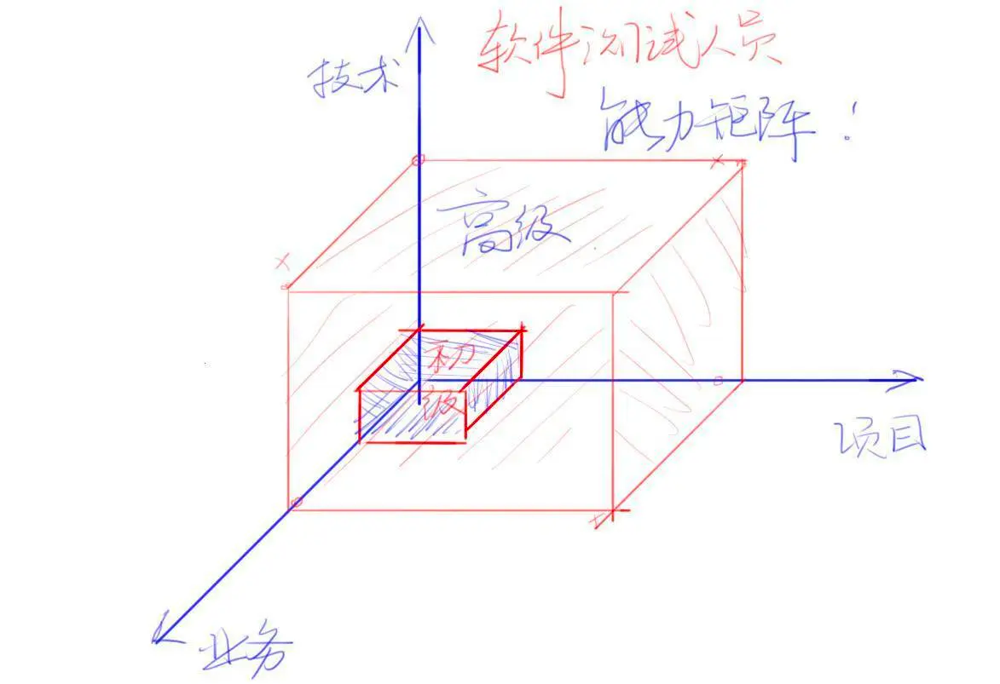
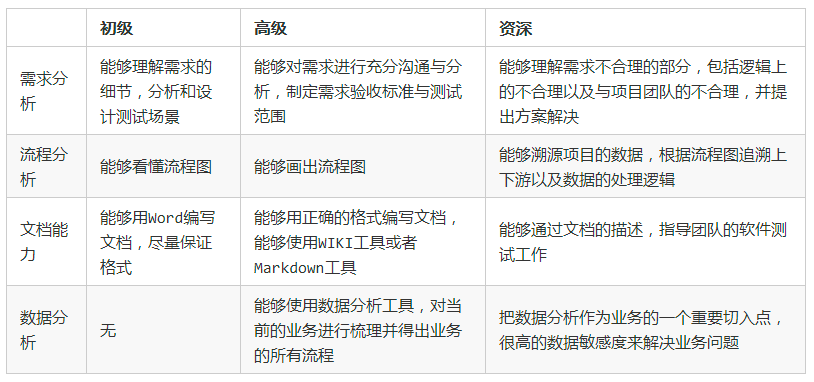
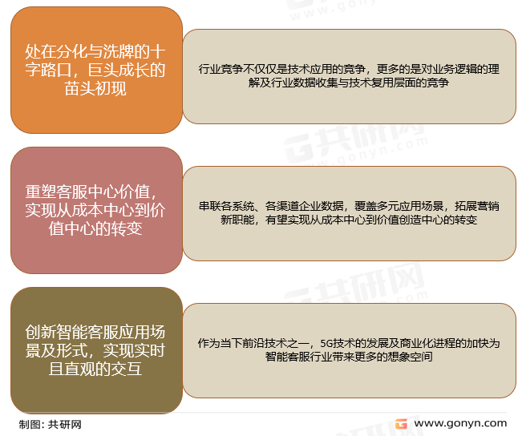
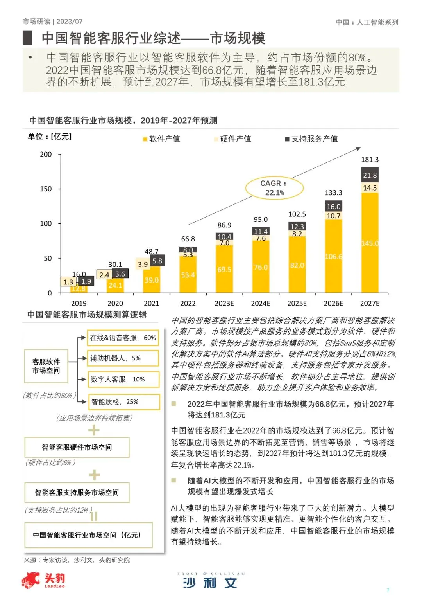
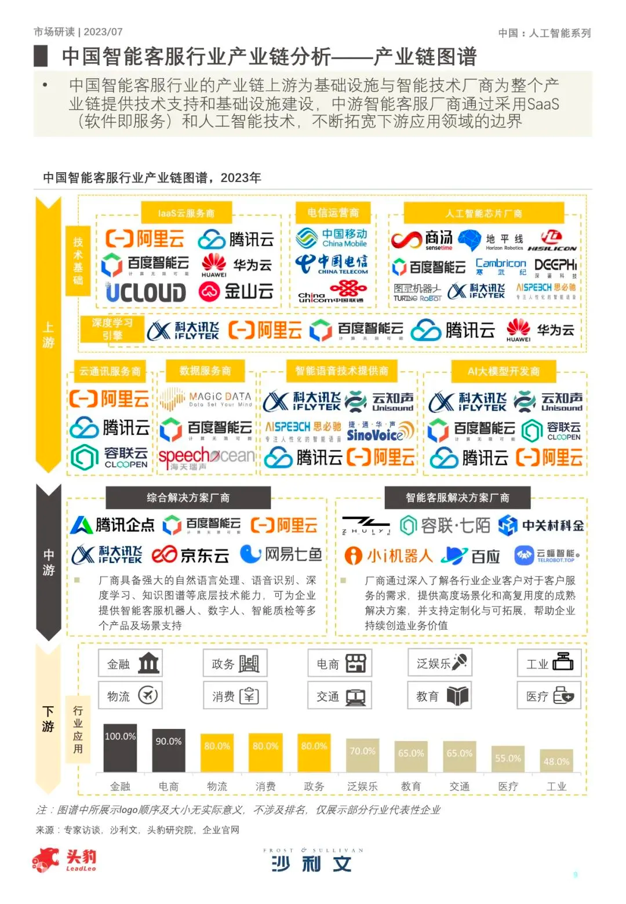
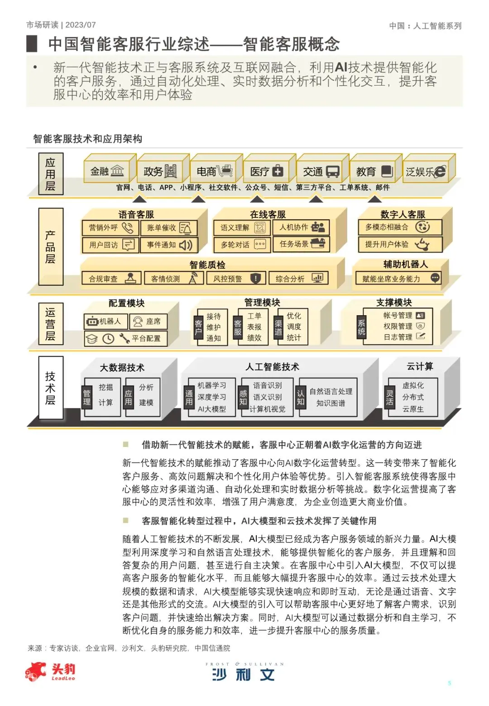

不同方向业务领域的市场对比

| 方向   | 当前市场份额 | 市场潜力 | 玩家|
|------|-----------|-----------|-----------|
| 互动白板 |         | 450亿RMB ｜Miro、 |
| 智能客服 |   |  | |

# 语音通话

# 视频通话

# 直播聊天

# 互动白板
## 功能分析
白板管理：画面内容、画面数量
课件管理：上传、切页、放大缩小
标注工具：画笔、形状、文本、箭头、激光笔、抓手
房间管理：加入、退出、邀请他人
扩展插件：代码编辑器、geogebra、课堂答题器、计时器、H5交互课件
视频管理：录制、回放

## 市场分析
市场份额：全球交互式白板市场从 2023 年到 2030 年将以 8.0% 的复合年增长率增长，到 2030 年将达到 62.6 亿美元（约441亿美元）。
市场玩家：miro、小画桌、氢图、Fabrie、
当前普及程度：

## 白板技术：
白板画面传输技术：

|       | 视频流模式                                                                                                                                                                                                                 | 文件+信令模式                                                                                                                                                                         | 
|-------|-----------------------------------------------------------------------------------------------------------------------------------------------------------------------------------------------------------------------|---------------------------------------------------------------------------------------------------------------------------------------------------------------------------------|
| 实现方式  | 老师端会经常采集和共享某个窗口、屏幕或区域，然后通过对窗口、屏幕、区域进行画面采集，通过视频前处理、编码、传输达到学生端，学生端再进行解码后处理，并最终渲染出来，整个过程和音视频没什么区别                                                                                                                        | 通过文档服务对文件进行上传、转码、分发、下载和渲染。在这个过程中，当有操作时便通过信令服务转发操作信令                                                                                                                             |
| 优缺点对比 | 1.带宽占用高：视频流模式很明显，它具有更高的带宽占用，尤其是在分辨率和帧率越高，码率越大的情况下，带宽占用也会相应的增多  2.清晰度低：视频流模式不支持矢量放大，且容易受网络状态的影响，在网络条件较差时，为了保证音视频流畅度往往需要降低码率，从而导致清晰度更低   3.由于视频流模式会涉及视频的编解码、处理、渲染，所以对终端的性能要求比较高，而文件+信令模式只是文件和图元的渲染，对终端的性能要求比较低。 | 1.带宽占用少：文件+信令模式除了文件上传和下载还有中间的信令传输，数据量比较小，所以它的带宽占用比较低，而且是在有操作的情况下才有信令传输  2.清晰度高：文件+信令模式则受网络状态的影响较低，只要网络条件能够确保把文件下载下来，通过矢量放大就可以达到很高的清晰度   3.文件+信令模式只是文件和图元的渲染，对终端的性能要求比较低 | 
|       |                                                                                                                                                                                                                       |

参考文档：

# 视频会议
# 控制协议
目前视频会议行业的国际标准有H.320、H.323（ITU）和SIP（IETF）3个标准集。其中H.323是目前主流的标准。SIP是已经确定的下一代标准。

# 协议
视频会议终端将输入进来的视频使用H.261、H.263、H.264或H.265协议、音频使用G.711、G.722或G.728数据

回答问题方式：一句话总结结论，再分点说原因

# 产品经理准备

## 1. 自我介绍

## 2. 为什么想做产品经理？
结论：产品在职业发展、个人发展、收入方面，上升空间都比测试更大
原因：
原因1（说明不想做测试的原因）：首先，产品经理的思维方式是大局观，测试的思维方式是扣细节，产品经理的思维方式对职业发展个人发展都会形成正向作用，而测试的思维方式会对职业发展个人发展都起反作用，时间长了，从事软件测试的人不仅在工作中不被同事喜欢和认可，在个人生活的人际交往中也变得困难，而产品经理在工作中形成的技能会让整个人越来越发光，在人际交往中越来越如鱼得水，所以当个人能力达到产品岗位要求时，我觉得应该考虑转型了
原因2（说明选择产品的原因）：其次，有些测试负责的项目是业务不连续的，这个项目测几天那个项目测几天，业务连续性不足，更多重复劳动带来的只是熟练度的积累，却无法形成突破式成长。而我比较幸运，入行测试以来，所负责的项目都是连续稳定的项目，在工作中，我可以通过不同的客户诉求、定制化的场景培养业务思维，我自己也一直有意识去培养自己的产品思维，所以这几年的测试工作使我有了非常多的业务积累，我认为我通过测试岗位积累的能力已经达到了产品的要求，甚至在业务、硬技能方面，比没有技术背景的产品更有优势
原因3（个人天赋能否胜任产品）：最后，大学参加过校级文艺部、当过团支书、做过冰箱销售，这些经历锻炼除了不错的表达能力、沟通能力、应变能力

产品经理能力矩阵：业务能力>商务能力>项目管理能力(资源协调能力)
测试开发能力矩阵：技术能力>业务能力>项目管理能力

参考文档：https://zhuanlan.zhihu.com/p/37590332

## 3. 为什么恒生离职不直接转做产品而是转了测试？

## 4. 怎么理解产品思维和产品工作的？
结论：产品思维对于产品经理的工作十分重要，不仅产品经理，任何工作岗位，思维方式都对工作进行十分重要，所以产品经理一定要具备优秀的产品思维
展开说说：
   产品思维非常像老板思维，老板思维中最重要的思想是就两点业务思维和商业思维。业务思维以需求为核心，商业思维以ROI为核心
   所以产品思维更简单点说就是识别有哪些需求？不同需求的ROI是多少？优先做ROI高的需求

   老板做的事情是什么？识别商机、分析团队能力能不能干这个事、分析干这个事情需要多少成本、做成了能得到多少回报、利润率是多少？
   C端产品需求？有哪些运营活动，哪些运营活动价值更大，
   B端产品的？识别需求，分析团队实现需求的能力、分析研发成本也叫估时、分析投入产出计算ROI，优先做ROI高的需求，后做ROI低

总结：老板>C端产品>B端产品，C端产品是mini版的老板，B端产品是mirco版的老板

## 5. 你认为优秀的产品经理是什么样的？
优秀的产品经理是市场需求导向的、擅长决策、拥有洞察思维的产品经理，知识性内容对这个职位的价值有限（ps，关于洞察力：洞察力就是变无意识为有意识,洞察力是是掺杂了分析和判断的能力，是看破表象，分析背后内涵的习惯）
洞察思维参考文档：https://www.woshipm.com/zhichang/1315329.html

## 6. 如何识别需求？
结论：站在用户视角去关注用户的问题
展开说说：识别需求的过程就是层层剥茧定位客户痛点问题的过程。那么在这个过程中，首先一定要对自己的产品非常了解，然后多问客户几个问题，
        比如客户的使用场景是什么？这个客户的使用方式和其他客户有什么区别？为什么其他客户没有反馈这个问题？如果当前状态不是最好的？你们理想的方式是什么？
        多问问才能发现是不是伪需求？有没有价值去做？如果客户非常繁忙，不愿多沟通，至少也要问清楚业务场景和使用姿势。 
        然后对于真正的需求，设计出既能解决用户问题，又与当前系统兼容的解决方案

## 7. 产品经理怎么获取需求？（换个问法：你认为需求来源于业务么）
结论：需求不全是来源于业务，业务只是获取需求的一个途径
展开说说：需求分为优化完善当前产品、孵化全新产品。面对处于不同阶段的产品，需求来源也不同。如果是已经有现成的产品，那么需求来源主要是业务用户方的反馈、运营方
         如果是孵化全新产品，那么需求来源一般是市场，感受市场的潮流、感受市场需要什么

## 产品经理在找需求的过程中，要忌“没有需求创造需求”
比如出来一种新技术，大家都在探索应该将新技术应用到什么方向上？比如最近的aigc，有些应用方向很好，有些就很扯淡，比如阿里推出的chat2DB，
这是一个能够将自然语言转换为SQL，也可以将SQL转换为自然语言的数据库客户端软件。
为什么说这个需求很扯淡呢？首先就是产品经理认为创建table、编辑table、插入数据的过程都是写sql完成的，这说明产品经理根本不了解技术人员使用数据库的场景，
设计这款工具的产品经理既不是数据库的深度用户、也没有去调研过现在数据库客户端的现状。实际上技术人员在使用数据库时，创建table、编辑table都像是编辑excel表哥一样完成的，
右键点击新建table，新建table后右键点击新建字段，只有插入数据sql、更新数据sql是真正通过写sql完成的，但是insert sql和update sql都非常简单，是技术人员最基础的必备技能，
没必要再花时间和精力去熟悉一套新的语法规则。

## 8. 产品经理需要懂技术么？
对于产品经理需不需要懂技术，有两种观点

观点1:
结论：应该略懂一些技术，但不能太懂
原因：不懂技术，在跟研发团队交流时很被动，无法跟研发团队表达自己要做的功能真正应该是什么，太懂技术，容易越界，插手研发被研发抵触，合作过程变得不顺利不愉快
举例：比如做一个热点功能，研发提供了几种方案，方案1文本存储热点，手动修改文本；方案2:根据算法自动生成热点，数据库存储，实时自动更新
观点2:
结论：越懂越好。有些人认为产品应该略懂一些技术，但不能太懂，我不这样认为。
原因：觉得产品不能太懂技术，格局小了。马化腾、刘强东、张一鸣、梁汝波都是技术出身，哪个不是精通技术呢，只有精通技术，才能运用前沿技术开发出爆款产品，但是这种产品不适合打工人，更适合创始人

所以我认为产品经理应该懂技术，越懂越好，但是为了团队合作顺利进行，不应该表现出自己的太强势的技术能力

## 9.是否会画高保真，你认为产品经理是否需要画高保真？
不需要，高保真是交互设计师、视觉设计师、UI设计师负责的事情，产品经理不应局限于细节，更应该注重大局观，尤其是B端产品经理最重要的业务逻辑清晰、业务路径简单。

## 10.更倾向于做c端、b端、还是中后台产品
结论：
展开说说：
       C端产品的特点是什么，对产品经理的能力要求是什么
       B端产品的特点是什么，对产品能力的能力要求是什么
       个人的经验积累以及能力积累更适合B端，虽然大部分产品经理都喜欢做C端，但C端不适合我

## 11.说一下你最成功or最失败的事情？

## 12.分析一下云客服这款产品？
问题：目前云客服的市场份额是多大，潜力市场是多大，当前市场上有几个玩家，头部玩家是哪几家？各家的优势是什么？哪家最有可能成为top1？  
答案：当前市场份额70亿～80亿，预计2027年可达到180亿，当前市场玩家分为上中下游，上游是云企业提供底层能力支撑，中游是智能客服解决方案厂商，包括Saas厂商等，下游是用户。
聚焦到中游智能客服Saas厂商这块，一共有网易七鱼、udesk、智齿、小能、美洽、追一、百应 等7家厂商，目前行业内并未出现寡头垄断的局面，各玩家“混战”激烈，马太效应并不明显，行业壁垒并不牢固，
对新入局的玩家也相对“友好”。但资金、人才等要素已经出现逐渐向部分供应商企业靠拢的趋势，行业处在分化过渡的十字路口。

参考文档：2023年中国智能客服市场报告 https://zhuanlan.zhihu.com/p/647724689

## 12.分析一下流媒体音视频市场？

参考文档：
https://pdf.dfcfw.com/pdf/H3_AP202208251577625435_1.pdf
https://36kr.com/p/1887443238113542

## 12.你有什么要问我的？
咱们的产品现在处于什么阶段？是初创产品还是成熟产品？市场定位是什么？现在有哪些客户？未来发展方向是什么？想要一个具备什么素质的产品经理？

